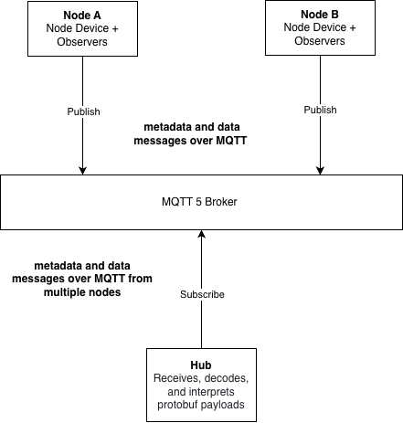

== Overview (informative)

=== Background

In February 2024, a WMO workshop in Geneva brought together representatives from WMO and the Hydro-Meteorological and Environmental Industry (HMEI) to address the lack of standardization in first-mile data collection. While international data exchange is standardized through WMO, no equivalent standardization exists for the first-mile segment, the connection between field equipment and centralized data collection systems, leading to a proliferation of incompatible proprietary formats and significant integration effort for operators of observing networks. The workshop recommended focusing first on output interoperability, and the Standing Committee on Information Management and Technology (SC-IMT) subsequently established the Task Team on First-mile Data Collection Standardization (TT-1M) to produce this specification.

[TODO] Add data flow figure showing 1st mile, DCPS and WIS2.

=== Solution overview

The first-mile segment covers the connection between field equipment and the systems that collect and process observations. In this specification, the field equipment is represented as the Node and the receiving system as the Hub. Communication is strictly unidirectional, with the Node transmitting protobuf payloads over MQTT to the Hub. The Node represents the remote station or logger through a Node Device and may describe attached sensors as Observer Device entries, as illustrated in xref:fig-node-hub[xrefstyle=short]. The two top-level payloads are the `data` message, which carries Observation content, and the `metadata` message, which carries the descriptive context needed to interpret those observations. Detailed message structure is described in Clause 7, standard name binding in Clause 8, and MQTT protocol binding in Clause 9.

[[fig-node-hub]]
.Node and Hub architecture

==== Message flow

In typical operation, the `metadata` message is sent when the Node is initialized and whenever the station configuration changes, and the `data` message is sent as observations become available. This separates relatively stable descriptive information from frequently changing measurement values and supports both individual and batched Observation delivery. Where a measurement is unavailable, the value is represented explicitly using `emptyValue` rather than being inferred from zero or omission.

==== Conformance class summary

[cols="2,5"]
|===
|Conformance class |Summary

|Core Data Model
|Covers the protobuf structure and semantics of the `data` message, `metadata` message, Observation content, devices, Parameter Definition content, and explicit missing values.

|Standard Name Binding
|Covers how Parameter Definition entries associate parameters with controlled standard-name vocabularies and namespaces.

|MQTT Protocol Binding
|Covers how protobuf payloads are conveyed over MQTT in the unidirectional exchange between Node and Hub.

|Node
|Covers the sender-side behavior for constructing and publishing `metadata` message and `data` message payloads.

|Hub
|Covers the receiver-side behavior for accepting, decoding, and interpreting payloads received from the Node.
|===
